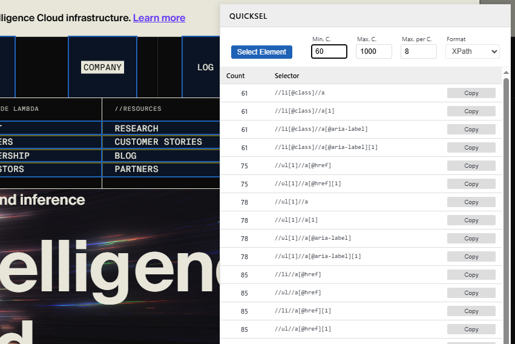

# QuickSel 1.0 - Custom Xpath generator

## Introduction
QuickSel is a tool for generating xpath selectors based on a provided number of elements.

This tool is best fit for:
- Front-end web developers/designers
- Automation experts
- Data engineers

## Install

### Developer - load unpacked extension

- Download/clone repo
- Go to chrome://extensions
	- Check "Developer mode" to on
	- Click "Load unpacked"
	- Choose the repo folder
- The extension should now be loaded and be available to reloaded tabs

# Contact
To request a feature, create an issue here or email jmckdev@gmail.com
